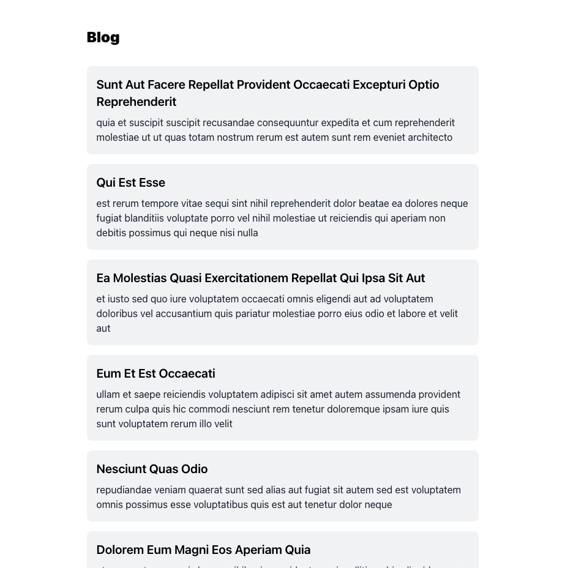
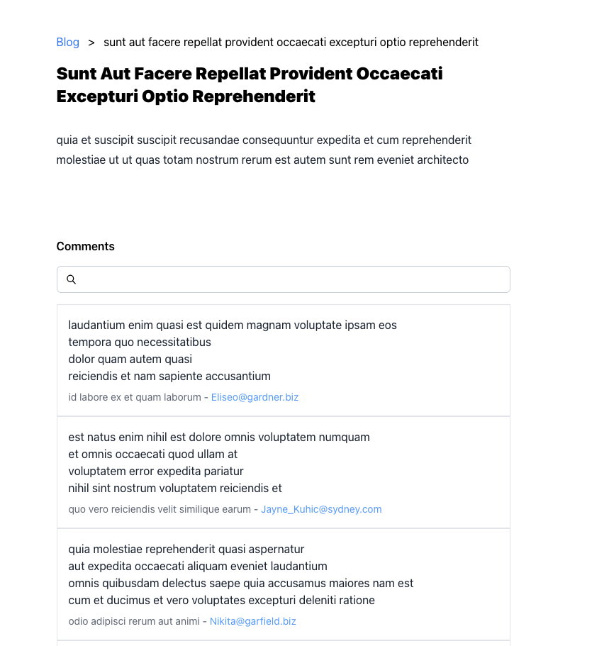
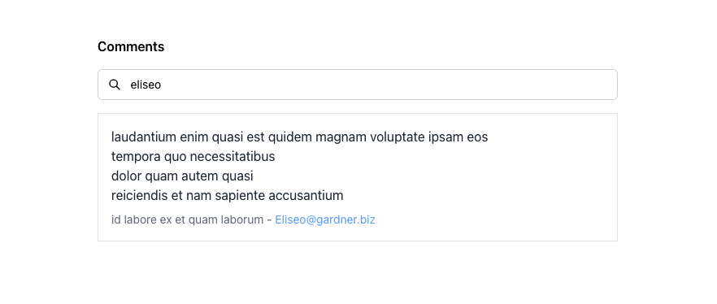

## Development URL
[Live URL](https://mindworks-frontend.vercel.app/)

## Setting up the development environment 🛠

1. Clone this repo or download the zip folder.
2. Run the `npm install` to install all the dependency.
3. Make a copy of `.env.example` to `.env`
4. Run `npm start` in the root folder to start the application

## Script to run
```
npm run start       -   To run the application in port 3000
npm run build       -   To build for production usage
npm run test   	  -   Run unit test cases
```

## Screenshots

**List of posts**


**Single post**


**Search**
